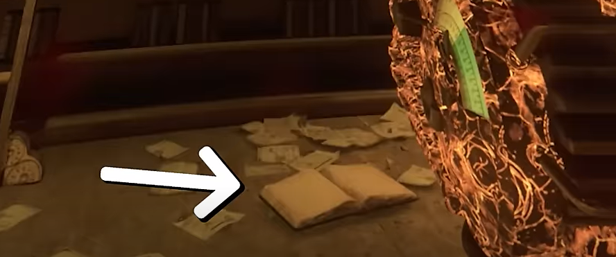
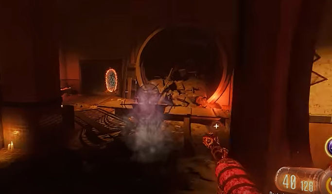
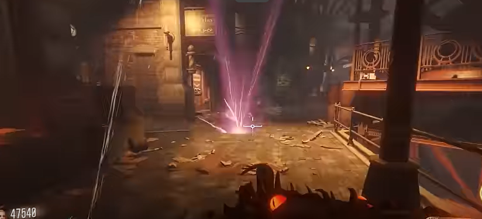
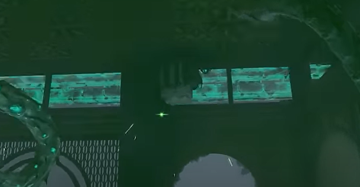

# Shadows of Evil Main Quest Guide

## Recommended setup:
* Pop Shocks
* Fatal Contraption
* Fear in Headlights

## Note:
* Need four players
* All four players need to build and upgrade swords

## Steps

### Step 1:
Activate pack-a-punch.

### Step 2:
Get setup.

### Step 3:
Interact with a book on the floor in front of the bookshelf in Nero's lair.\
\
\
\
Pick up the flag in the subway.\
\
\
\
This will make it so that only parasites and meatballs spawn in. Bring the flag up to the electric spot on the ground in the junction.\
\
\
\
This will cause a wave of meatballs to come in and try to destroy the flag. Parasites will also be present when the Shadow Man appears. Keep an eye out for the Shadow Man, shoot him if you see him. Once you hear an ding sound pick up the flag and bring it to the next spot. If the flag is destroyed, you must try again. Once the second spot is done, pick up the flag and bring it into Nero's lair. Hand it to the keeper and kill the margwa that spawns. Dont walk on the purple symbols, they will damage you.

### Step 4:
Go to the next round. Pick up the flag in the subway, bring it to the Canal district. Place the flag down in the designated spot. Once done twice like before give the flag to the keeper in the Ruby Rabbit and kill the margwa.

### Step 5:
On the next round grab the flag in the subway and complete the same steps in the Footlight district. Once done bring the flag to the keeper in the Black Lace Berlesque. Kill the margwa.

### Step 6:
On the next round grab the flag and bring it to do the steps in the Waterfront district. Once done give the flag to the keeper in the boxing gym and kill the margwa.

### Step 7:
Have all four players interact with a keeper at the same time. The Shadow Man will appear, make sure one players is standing by the ritual table. Shoot the Shadow Man, he will move across the room. Make sue to hit him as quickly as possible. When he is above the ritual table shoot him and have the player standing ther interact with the table. He will be turned into a gateworm. If you are not fast enough a margwa will spawn in and you must interact with the keepers again.

### Step 8:
At this point a pink effect will emerge on the screen, when this happens, the player will soon die. There are glowing orbs that will prevent this when picked up. Dont walk over the symbols on the ground either. During this phase margwas will spawn in, when you kill one it will turn on a beast pedestal. Every player needs to be able to turn into the beast. Each player needs to be stationed at each tram station with one in the middle junction. Three players need to be in beast mode, beast mode will be infinite unless damaged (andmaybe when you revive someone too). The final player will need to call the tram to their location and then enter beast mode. The player in the juntion will wait for the tram to destroy the gateworm in the center of the juction, right before that the middle player should tell all players to zap this box that is located at each tram station:\
\
\
\
This will cause the rail to turn blue. Once the gateworm in junction is destroyed, the player there in beast mode needs to very quickly zap the three keepers floating there. This will make all of the rails blue and so they will fire a laser into the sky.

### Step 9:
gg that was stressful
