# Shadows of Evil Shield Build Guide

## Builable table locations:
In the Canal district, near the entrance to the Ruby Rabbit.\
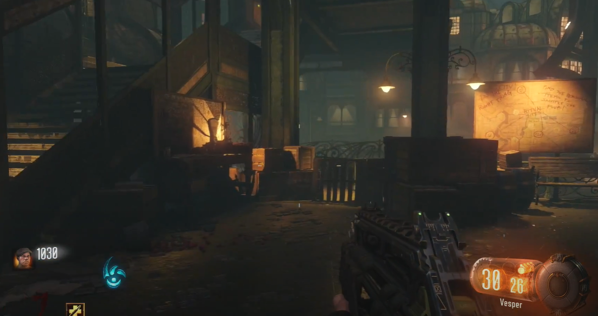\
\
In the Waterfront district, up behind the boxing gym.\
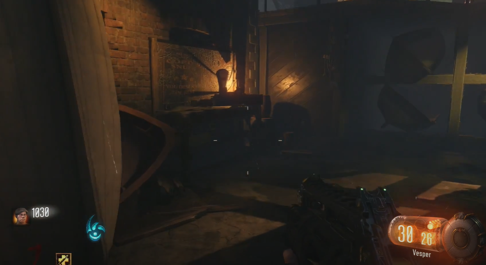\
\
In the Footlight district, by the tram station above street level.\
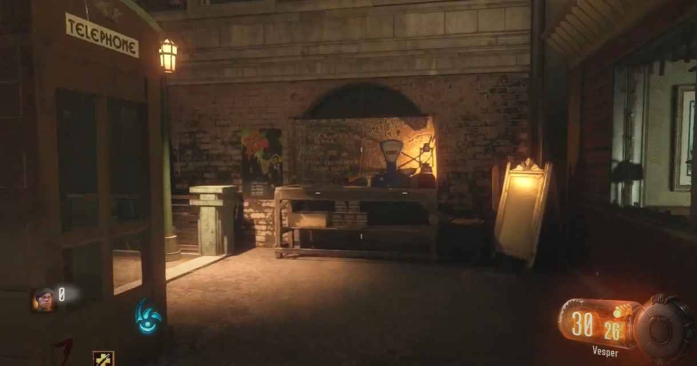

## Footlight part locations:
Next to the perk location here:\
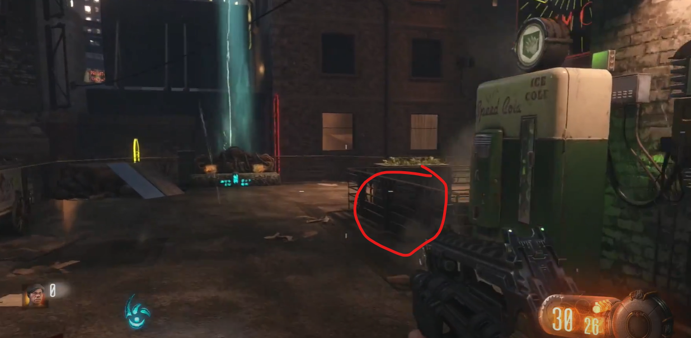\
\
At the bottom of tbe stairs leading to the street view.\
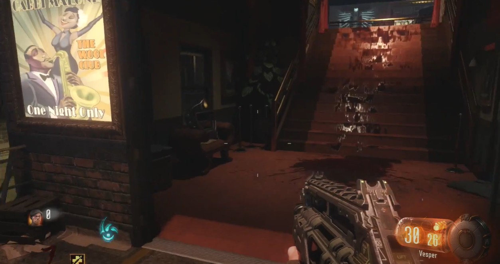\
\
Opposite the perk location on a bench.\
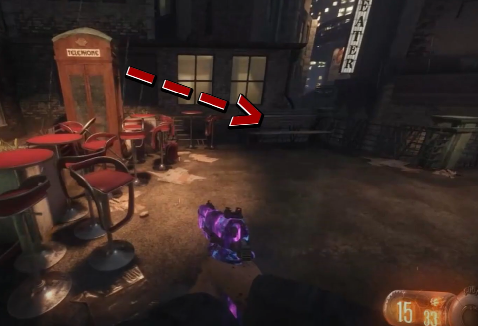

## Waterfront part locations:
Up the stairs to the perk location, up against some boxes.\
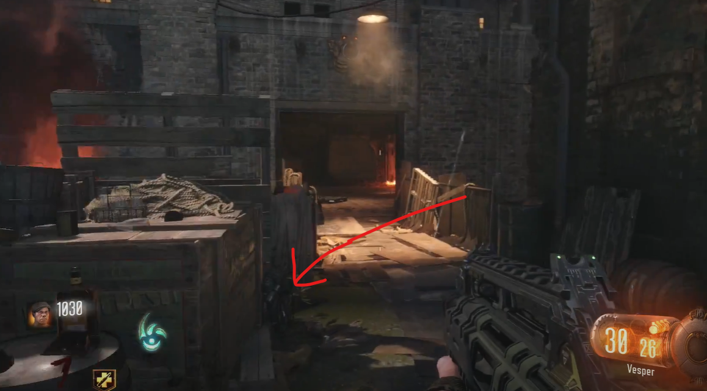\
\
On the wall in the perk machine room here:\
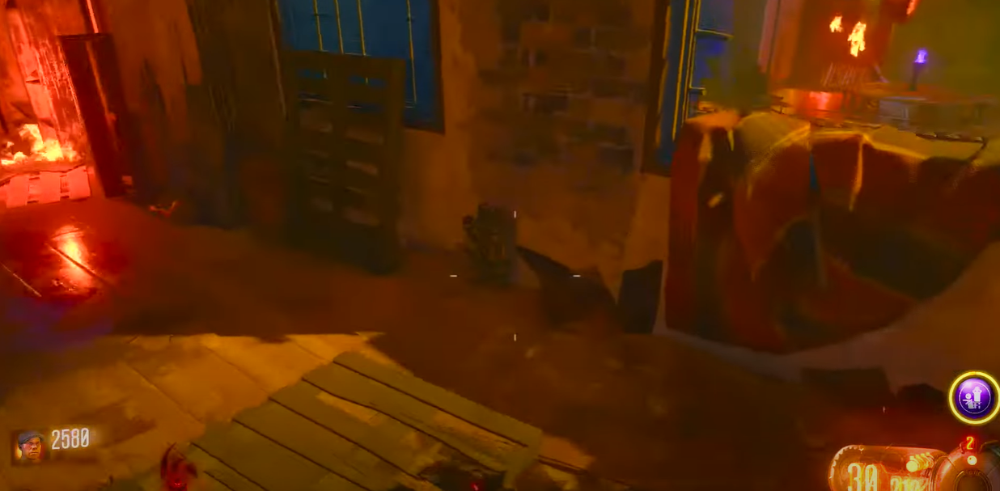\
\
In the room behind the perk location on the floor here:\

## Canals part locations:
In the second room above street level up against the glass here:\
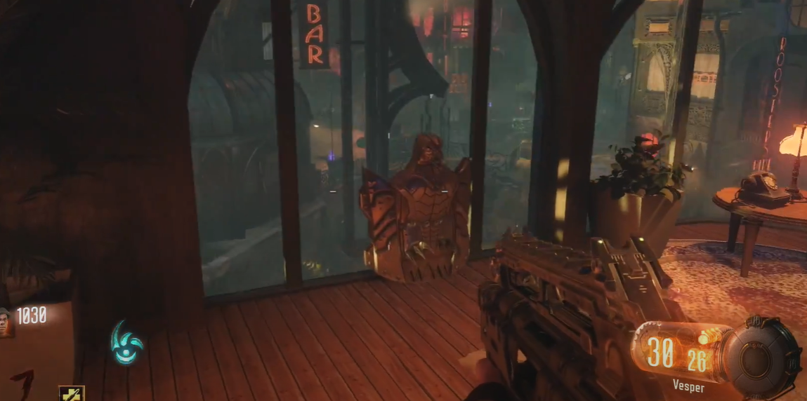\
\
On the bridge above the street level.\
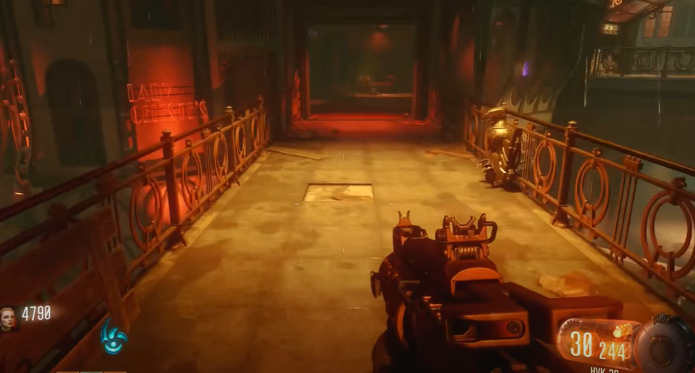\
\
Up against the wall at the top of the stairs leading to the perk location.\
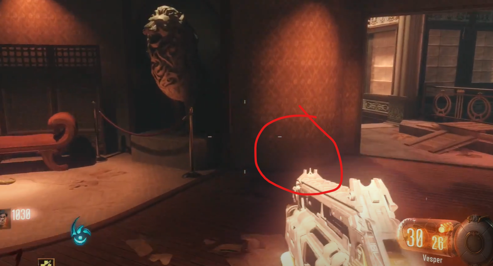
