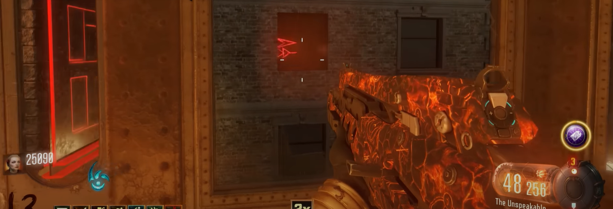
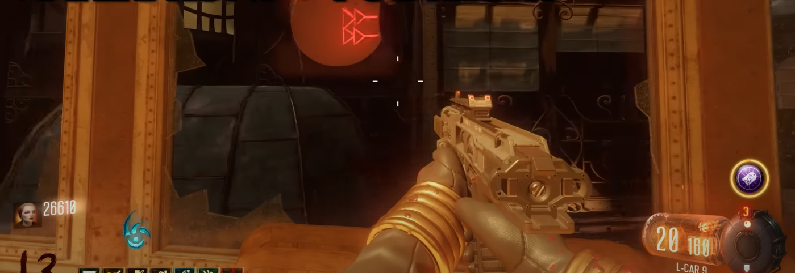
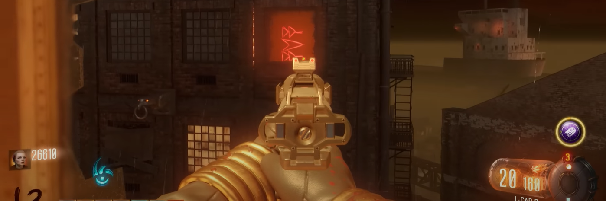
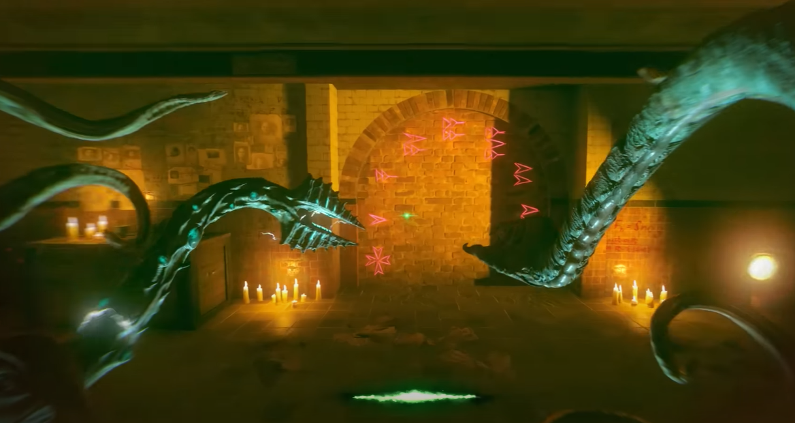
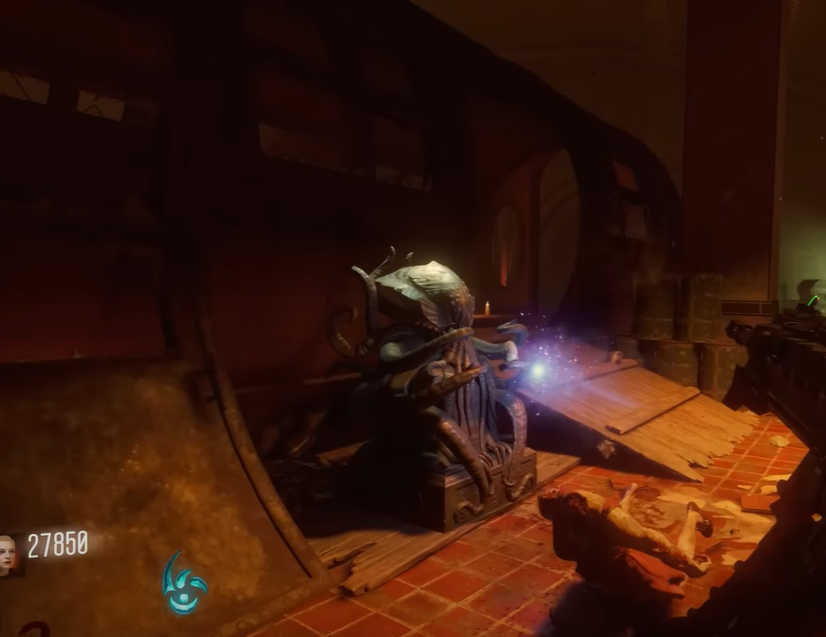
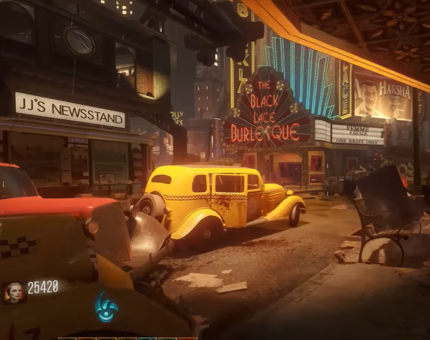
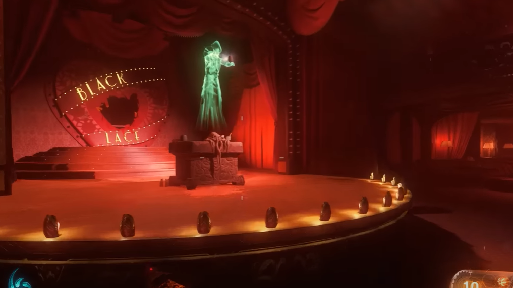
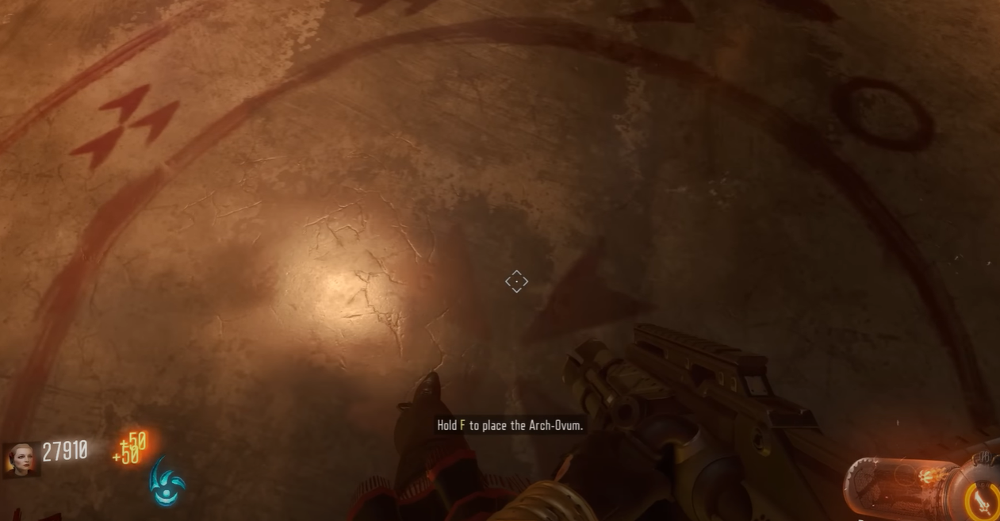
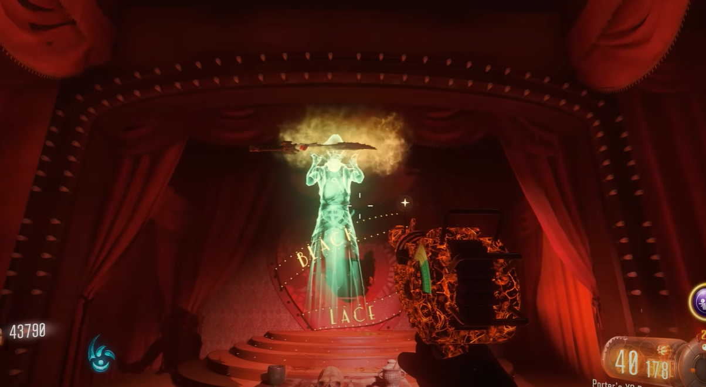

# Sword Guide

Three symbols will be in windows around the map. These symbols can only be seen while on the tram. There is one symbol in three of the districts. If the tram is leaving the Footlight district, it will be on the left, or the right if you are entering Footlight.\
\
\
\
If the tram is leaving the Canals district, the symbol will be on the left, or the right if it is entering the Canals district.\
\
\
\
If the tram is leaving the Waterfront district, the symbol will be on the right, or the left if it is entering Waterfront.\
\
\
\
Take note of all three symbols and go to the subway. Enter beast mode and zap the three symbols on this wall:\
\
\
\
This will reveal a area with swords and eggs. Grab an egg, the egg can be placed down on four statues that are in boxes that can be broken by beast mode.\
\
\
\
There is a statue in the same three districts and behind the spot with the eggs. Place the egg on a statue and kill zombies near by to fill it up. Once it is filled, pick up the egg and take it to another statue, repeat until all four statues have been done. Return to the original egg location and pick up the sword. Depending on whcih character you are, go to the following locations: Jessica goes to the Black Lace Burlesque.\
\
\
\
Jackie Vincent goes to the Ruby Rabbit. Floyd goes to the boxing gym. Nero goes to his apartment. At the characters location, where the ritual was conducted there will be a keeper, interact with it.\
\
\
\
Outisde of each of the ritual rooms there is a circular symbol on the ground. Interact with the symbol to spawn in two Margwas, kill them to complete the task.\
\
\
\
If you go down you will fail and will have to try again next round. You must do this for all four locations on four seperate rounds. Once all four have been complete return to your character's location and interact with the keeper to retreive the upgraded sword.\
\

